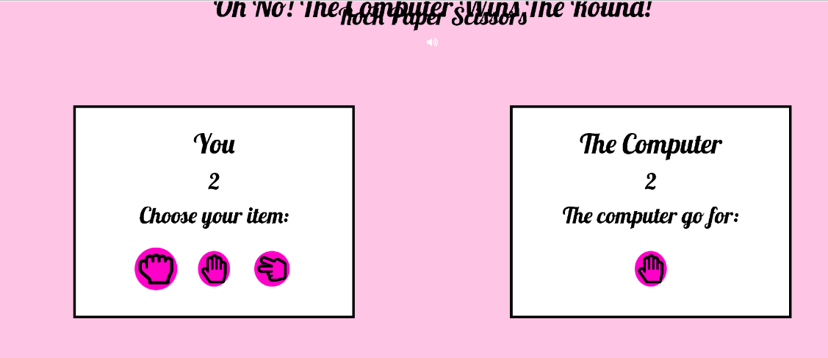

DON'T FORGET TO GENERATE THE TABLE OF CONTENT - 

<small><i><a href='http://ecotrust-canada.github.io/markdown-toc/'>Table of contents generated with markdown-toc</a></i></small>


# HACKATHON MAY 2022: GETTING CONNECTED
# Plugged-in Application

[](https://?????.herokuapp.com/)

Click [here](https://????.herokuapp.com/) to live site.  
------

## UX

UX Design is a process that can be used to design anything from products to bicycles to mobile applications. The focus of this design process puts the users' needs first--making their interaction with the application a pleasureable one.

#### Flexibility and efficiency of use

The aplication allow the users to tailor frequent actions by providing a simple and user friendly experience.

#### Aesthetic and minimalist design

The application does not contain irrelevant or rarely needed information, following a minimal design with pastel colours to make the aesthetic experience playful. The user has clear visibility of the application's information and usage.

## Purpose

[Code Institute](https://codeinstitute.net/se/) and [Trust in SODA](https://www.trustinsoda.com/) collaboratively organised the May Hackathon 2022 - "GETTING CONNECTED". The theme of the Hackathon was to highlight the importance of 'staying connected' with solutions to help people connect virtually for a more connected world.

Plugged-in aims to 'stay connected' with friends and family members by playing simple javascript games and competing within the group.
Get more people plugged into your group, play more games, to have immense competition on the games' scoreboards. 

## User Stories

### User Stories that have been satisfied by creation of particular apps in ths project:

| id  |  content |
| ------ | ------ |
|[#31](https://github.com/manni8436/stay-connected-hackathon/issues/31)| As a Player, I can register as a user and have the ability to log in so that my score is saved and connect with family and friends |


### User stories that are planned for next sprint

| id  |  content | 
| ------ | ------ |
|[#32](https://github.com/manni8436/stay-connected-hackathon/issues/32)| As a Player, I can play co-op games with family and friends and score up together |


## Wireframes 

Wireframes were created with [Balsamiq](https://balsamiq.com/wireframes/?gclid=Cj0KCQiAubmPBhCyARIsAJWNpiMYzrk_0rLzl3vgYKRLXwnX7rpqyQiUFdyt3xHGpRiHlZlozwO_pvcaAvUFEALw_wcB). This provided us a rough starting point to establish what we were going to put into the project and the direction to take. The end result has evolved multiple times from this inital concept.

- [Homepage - Desktop](/README_files/homepage-desktop.png)
- [Homepage - Tablet](/README_files/homepage-tablet.png)
- [Homepage - Mobile](/README_files/homepage-mobile.png)

- [Game Page - Desktop](/README_files/game-page-desktop.png)
- [Game Page - Tablet](/README_files/game-page-tablet.png)
- [Game Page - Mobile](/README_files/game-page-mobile.png)

- [Homepage - Desktop](/README_files/connect-with-us-desktop.png)
- [Homepage - Tablet](/README_files/connect-with-us-tablet.png)
- [Homepage - Mobile](/README_files/connect-with-us-mobile.png)

## Agile Methodology

### Kanban board and issues


Github issues were used to create the User stories and group them according to MoSCoW prioritization technique. Link to the project with live issues can be found [here](https://github.com/manni8436/stay-connected-hackathon/issues).


## Existing Features

### Navbar and Footer
The Navbar and footer were created using bootstrap. They have been adjusted for the project. The Navbar features colours that make it clearly stand out on everypage. On smaller screens the Navbar responds by collapsing into a hamburger menu. The Navbar displays The logo for the poject(pluged-in) in the top left corner. The logo links back to the home page. Other parts of the Navbar include links to each game, the group dashboard and the login page. When a user navigates on a smaller device, the links contained in the hamburger and are displayed in drop down when the hamburger is clicked. The Navbar has been designed to make it easier for the user to navigate around the site. 

The Footer has been used to dispaly copyright information on behalf of the Plugged-in team. This is displayed across all pages. As the Footer has been designed to show the information of the websites creators, there isn't much user interaction with it other than links to the Plugged-in teams information. 


### Home - landing page
The Homepage features a carasole, dispalying all the games on Plugged-in to the user. 

 
### Profile
The user's profile allows the user to track their scores inbetween games. This adds a competive element to the game. And allows the user to see their scores/progress. This adds good user engagement to the site.  


### Sign Up Page
The user can create thier own profile by accessing the sign up link on the Sign up page. They are asked to submit their email, create a username. Then re-enter their password to confirm. The information is entered into a container in the middile of the page. If the user ends up on this page by accident. Then there is a 
link asking them to sign up instead. The Sign Up page has been designed so that the user can quickly and easily create an account. 


### Sign In Page 
The user can sign into their account using this page. They are asked to enter their email/username and password. This information is entered in a container similar to in with the sign up page. There is also the link to the sign up page incase the user still needs to sign up. The Sign In page has been designed so that users can easily Sign In to their accounts and start playing games quickly.


### Games
The games in this application are simple JavaScript games aiming to provide a playful and fun user experience to the players. Canvas, Card Game, Quiz Game, and the Rock, Paper & Scissors are games from previous projects from Code Institute's students. Tetris and Ping Pong were implemented from external sources mentioned in the credits.

#### Cards game
The game is a take on the classic card game Snap. The game is aimed at all ages and genders. It features an Egyptian theme which can be enjoyed by all audiences. In particular, those with an interest in games and Egyptian Mythology.  The game aims to provide the user with an easy to use layout, easy to read instructions, and responsive feedback when selecting cards. Allowing the user to make the right selection. 


#### Rock Paper Scizors
This game is a take on the classic: Rock, Paper, Scissors. It was built using HTML, CSS and JavaScript. To interact with the game, the user will need to select either. Rock, Paper or Scissors. They will play against the computer. Whoever reaches 3 points first wins the game. This game is aimed at all ages and aims to provide a quick fun experience.


#### Quiz Game
Quizanaughts is a fun, interactive quiz. Aimed at older children between the ages of 9-13. The quiz aims to help educate younger audiences on space. The quiz covers a wide variety of space-related questions that help the user test their knowledge. The user can see how well they score via a scoring system. A timer has also been included to make the game more challenging. Both the timer and the scoring system helps to make the game more competitive. The quiz is a great educational tool and helps to create an awareness of space and learn about the history of space in younger generations.


#### Canvas
Canvas is a web-based painting page where users can use their creativity by painting and adding comments to the screen by using the mouse. 


### Ping Pong
Ping Pong, also known as table tennis, is a game in which two hit a little light ball back and forth across a table using a small paddle. The player plays against the computer, and the paddle is moved by using the mouse. A point is scored when a player fails to return the ball to the other player.


### Tetris
Tetris is a puzzle video game. In Tetris, players complete lines by moving differently shaped pieces, which descend onto the playing field. The completed lines disappear and grant the player points, and the player can proceed to fill the vacated spaces. The game ends when the playing field is filled. The longer the player can delay this outcome, the higher their score will be. 


## Future Features 
- Add a multiplayer feature.
Adding a multiplay feature to the games will allow the users to enjoy playing the games together and compete simultaneously. 
- Add co-op feature
adding the co-op feature to the games will allow more users to participate in the same match and create different groups complete with each other.
- Add capturing images on canvas
Adding the possibility to stick pictures to the canvas will make the user experience more engaging and interactive.


## Technologies Used

### Languages Used

   + HTML5
   + CSS3
   + JavaScript
   + jQuery (check if jquery was used ???)
   + Python
   + Django

### Technologies and Programs Used:
+ GitHub
    The Git was used for version control
    Git issues were used for user stories
    GitPod was used as IDE to write the code and push to GitHub
+ Heroku 
    The page was deployed to Heroku
+ PostgreSQL
    PostgreSQL was used as database for this project
+ AWS S3 bucket sstorage (check if AWS was used ???)
    for storing static files and media files

 ### Frameworks Libraries and Programs Used

+ Balsamiq:
    Balsamiq was used to create the wireframes during the design process.
+ Bootstrap 5:
    Bootstrap was used to add style to the website.
+ Bootstrap icons
+ Django

## Code Validation

### HTML beautify

[online HTML code Beautifier](https://htmlbeautify.com/). 

### HTML valiation

[HTML validator](https://validator.w3.org/nu/#textarea)


| App  |  Pages | Result |
| -----| -----------| ------ |
| Home |   base.html | [No errors](README_files/htmlok.png) |
| Dashboard |   group-dashboard.html | [No errors](README_files/htmlok.png) |
| Game |   card-game.html | [No errors](README_files/htmlok.png) |
| Game |rock-paper-scissors.html| [No errors](README_files/htmlok.png) |
| Game |quiz-game-home.html | [No errors](README_files/htmlok.png) |
| Game |quiz-game.html | [No errors](README_files/htmlok.png) |
| Game |canvas-art.html | [No errors](README_files/htmlok.png) |
| Game |game-5.html | [No errors](README_files/htmlok.png) |
| Login |game-6.html | [No errors](README_files/htmlok.png) |


### CSS validation

Due to extensive user of Bootstrap classes, only minimial styling was applied to the Home Page. Most of the CSS code comes from Bootstrap's carousel template with some modifications. 
The styling to the games was created with CSS code. The CSS code was validated with [Jigsaw Validator](https://jigsaw.w3.org/css-validator/) 

| App  |  CSS Pages | Result |
| -----| -----------| ------ |
| Home |   base.css | [No errors](README_files/CSS_Validator.png) |
| Game |   card-game.css | [No errors](README_files/CSS_Validator.png) |
| Game |   quiz-game.css | [No errors](README_files/CSS_Validator.png) |
| Game |rock-paper-scissors.css | [No errors](README_files/CSS_Validator.png) |


### JavaScript validation

Javascript code validation was complied on [jshint](https://jshint.com/)

None of the games returned any errors. See below for details.

| App  |  file | result |
| ------ | ------ | ------ |
|  games | card-game | [no errors](README_files/jslint-card-game.png) |
|  games | rock-paper-scissors | [no errors](README_files/jslint-rock-paper-scissors.png) |
|  games | quiz-game | [no errors](README_files/jslint-quiz-game.png) |
|  games | game-5 | [no errors](README_files/jslint-game5.png) |
|  games | game-6 | [no errors](README_files/jslint-game6.png) |

### Python beautify
All pages were initialy put through [Python Formatter](https://codebeautify.org/python-formatter-beautifier) which automaticaly sorted most of the too long lines errors. Than the code was checked by pylint and problems were displayed in the console. Once the issues were cleared I have put all code though pep8 validator.

### Pep 8 

```
Python3 -m flake8
```
### Python validator


| App name  |  file name | result |
| ------ | ------ |------ |
| home |  urls.py |  [all ok](README_files/???) |
| games |  urls.py |  [all ok](README_files/???) |


## Tests
------

### Automated tests

Automated tests have not been created due to time constrains of the project.

### Lighthouse


### Manual tests

Manual testing was performed by team members and below are all the manual tests performed on three of the games which details the test, expected outcome and result as well as user recommendation for some. This was used to improve the games where possible within the time constraint.

 #### Rock, Paper, Scissors

 #### Test 1
   - Test: does the navigation work in the game?
   - Expected outcome: all the navigation link will work
   - Result:  the navigation worked well and it was easy to see when you won or lost the game. The rules were clear to

#### Test 2
   - Test : what happens if you win and lose the game?
   - Expected outcome: 
      - For when I win: There will be a display to show that i’ve won the game
      - For when I lose: There will be a display to show me that i’ve lost. 
   - Results: when I won I got a pop up telling me that I had won, when I lost I got a similar pop up telling me that the computer had won. It wasn’t very clear when I won rounds though. The text was displayed at the top. The styling of the button at the bottom also seemed to not be responsive to smaller devices 

#### Test 3
   - Test: The buttons work for rock, paper and scissors
   - Expected results: The buttons will work correctly in the game
   - Results: All three buttons worked correctly

#### Card Game

#### Test 1
   - Test: All cards work correctly
   - Expected result: All the cards can be clicked on in all difficulties
   - Results: all the cards can be interacted with

#### Test 2 
   - Test: Does the navigation work as intended
   - Expected outcome: all the buttons will work correctly
   - Test results: the reset button works well resetting the game. The Moves: works well to track the number of moves the user makes. The easy medium and hard buttons work well changing the difficulty. I think that it would work better if these buttons didn’t reset progress when they’re clicked on though. Especially if someone was playing the game on their phone where it would be easier to miss click

#### Test 3 
   - Test: what happens if you get all of the matches? 
   - Expected outcome: the user would get a message saying well done or something similar
   - Test results: I wasn’t able to finish the game. None of the remaining colours matched. Also I was able to click on a card that i had previously turned over

#### Test 4
   - Test: Is the game responsive? 
   - Expected result: the game will respond well on all devices
   - Result: The game responded well on all devices. Both mobile and tablet

#### Quizanaughts

#### Test 1
   - Test: do all of the colours display correctly when clicking throught the questions?
   - Expected result: the right and wrong answers display in either green or red accordingly
   - Result: the colours displayed correctly

#### Test 2
   - Test: does the score display a running total? Does the user get one point for a correct answer and zero points for a wrong answer?
   - Expected results: the user will get a rolling total  score on the questions
   - Result: the score adds up correctly, all correct answers add 1 point and incorrect answers add 0 points
   - This was achieved by: I clicked through all the answers making sure that the total was correct when I scored on each questions, I did this multiple times on each question

#### Test 3
   - Test: what happens if you run out of time?
   - Expected results:
      - Timer goes to 0
      - Pop up message displays telling  the user that they have run out of time and their score out of 15
      - User can no longer select an answer
      - User is taken to a navigation selection with options home and play again
      - Running out of time resets the question number to 1
  - Results:
    - Timer goes to 0
    - Pop up message displays telling the user that they have run out of time and thier score out of 15
    - User can no longer select an answer
    - User is taken to a navigation selection with options home and play again
    - Running out of time resets the question number to 1
- This was achieved by: I went through each individual question and waited for the timer to reach 0 seconds

#### Test 4
   - Test: what happens if you achieve the highest score and the lowest score?
   - Expected outcome:
     - Score= 15,0
     - Congratulations message, try again message
     - Navigation buttons work as expected 
   - Test outcome:
     - Score= 15, 0
     - Congratulations message displays for 15 and 0. 
     - Navigation buttons worked as expected 
   - This was achieved by: I scored correctly on all the questions/ I scored 0 points on all the questions

#### Test 5
   - Test: the questions track correctly, displaying which question number the user is on?
   - Expected result: the question number increases, resets and the progress bar increases
   - Test result: the question number increases, resets and the progress bar increases, following the users progress
   - This was achieved by: I went through the questions, reset the questionnaire(try again)

#### Test 6
   - Test: is the game resonive to all devices?
   - Expected result: the game will be responsive
   - Result: the game was responsive. However, on smaller screens the content seemed to align to the left or the screen


## Project Bugs and Solutions:

- Responsiveness issues with Quizanaughts game on screen for mobiles at size 320px. This happened due to padding creating a scroll effect and the width size being set too wide for mobile at 400px. Once the width was changed and padding removed the game was fully responive on tablet and mobile.

## Bugs left in the project

- The pop-up message to the user when playing the game in Rock, Paper & Scissors is misplaced on smaller screens creating a bad user experience for the player when using it on small screens. Due to lack of time, this bug was left unfixed in the project.
 |

## Deployment and making a clone

### Deployment to heroku

**In your app** 

1. Add the list of requirements by writing in the terminal "pip3 freeze --local > requirements.txt"
2. Git add and git commit the changes made

**Log into heroku**

3. Log into [Heroku](https://dashboard.heroku.com/apps) or create a new account and log in

4. Top right-hand corner click "New" and choose the option Create new app, if you are a new user, the "Create new app" button will appear in the middle of the screen

5. Write app name - it has to be unique, it cannot be the same as this app
6. Choose Region - I am in Europe
7. Click "Create App"

**The page of your project opens.**

8. Go to Resources Tab, Add-ons, search and add Heroku Postgres

9. Choose "settings" from the menu on the top of the page

10. Go to section "Config Vars" and click button "Reveal Config Vars". 

11. Add the below variables to the list

    * Database URL will be added automaticaly
    * Secret_key - is the djnago secret key can be generated [here](https://miniwebtool.com/django-secret-key-generator/). 


**Go back to your code**

12. Procfile needs to be created in your app
```
web: gunicorn PROJ_NAME.wsgi
```

13. In settings in your app add Heroku to ALLOWED_HOSTS

**Go to your terminal**

14. Add and commit the changes in your code and push to your branch

15. Log into Heroku from your commandline:

```heroku login -i```

16. Type your email and password and you should be logged in to heroku

17. Connect your repository to heroku by typing in commandline

```heroku git:remote -a YOUR-APP-NAME```

18. Push the changes from your branch to Heroku
```git push heroku main```

19. It can take a while, you should see the heroku log that shows you the stages of deployment

20. If the deployment was succesful you should get the link to your app in the terminal, follow the link to the live page


### Forking the GitHub Repository

By forking the GitHub Repository you will be able to make a copy of the original repository on your own GitHub account allowing you to view and/or make changes without affecting the original repository by using the following steps:

1. Log in to GitHub and locate the [GitHub Repository](repo here???)
2. At the top of the Repository (not top of page) just above the "Settings" button on the menu, locate the "Fork" button.
3. You should now have a copy of the original repository in your GitHub account.

### Making a Local Clone

1. Log in to GitHub and locate the [GitHub Repository](repo here???)
2. Under the repository name, click "Clone or download".
3. To clone the repository using HTTPS, under "Clone with HTTPS", copy the link.
4. Open commandline interface on your computer
5. Change the current working directory to the location where you want the cloned directory to be made.
6. Type `git clone`, and then paste the URL you copied in Step 3.

```
$ git clone http..repo here???
```

7. Press Enter. Your local clone will be created.

### Setting up your local enviroment

1. Create Virtual enviroment on your computer or use gitpod built in virtual enviroment feature.

2. Create env.py file. It needs to contain those 5 variables.

* Database URL can be obtained from [heroku](https://dashboard.heroku.com/), add PostgreSQL as an add on when creating an app. 
* Secret_key - is the djnago secret key can be generated [here](https://miniwebtool.com/django-secret-key-generator/). 
* Google API key can be obtained [here](https://cloud.google.com/gcp?authuser=1) you will have to register with google and create new app to get the API key. Follow the instructions on the website.

```
DEVELOPMENT
SECRET_KEY

```
PostgreSQL and AWS keys are needed only on Heroku, not in local IDE

3. Run command 
```
pip3 install -r requirements.txt
```


### Getting email variables from gmail


- Log into gmail account
- Go to Settings and than See all settings
- Top menu go to Accounts and import
- Find on the list Other google account settings
- Left side menu - Security
- Turn on two step verification: add phone number and follow instructions
- Go back to security
App passwords - Select Mail, Select Device - Other, Django, Copy app password.

In Heroku 
EMAIL_HOST_PASS is the password copied from above.
EMAIL_HOST_USER is the gmail email address


## Credits 
### Online resources
* [Icons8](https://icons8.com/)
* [unsplash](https://unsplash.com/)
* [Fontawsome](https://fontawesome.com/)
* [Bootstrap 5]()
* [Markdown best practices](https://www.markdownguide.org/basic-syntax/)
* [Markdown Table of content generator](http://ecotrust-canada.github.io/markdown-toc/)

* [icon](https://www.flaticon.com/free-icons/trees)
* PNG to SVG [converter](https://convertio.co/download/d39aa7f30e79f4379b9bce697c5afe384b5853/)
* Resizing photos by [photoresizer](https://www.photoresizer.com/)
* [Tetris Game by Rosetta Code](https://rosettacode.org/wiki/Tetris/JavaScript)
* [Ping Pong Game By Code Explained](https://www.youtube.com/watch?v=nl0KXCa5pJk)

### Tutorials and inspiration

* gather app

### People

Meet the team behind Plugged-in:
- [Emanuel Silva](https://github.com/manni8436)
- [Joanna Gorska](https://github.com/JoGorska)
- [John Bachtiger](https://github.com/Jbachtiger)
- [Sam Hulme](https://github.com/SamHulme1)
- [Vanessa Anna-Maria Andersson](https://github.com/van-essa) 

Also a big thank you to:
- Sean Young for supporting our team as a facilitator
